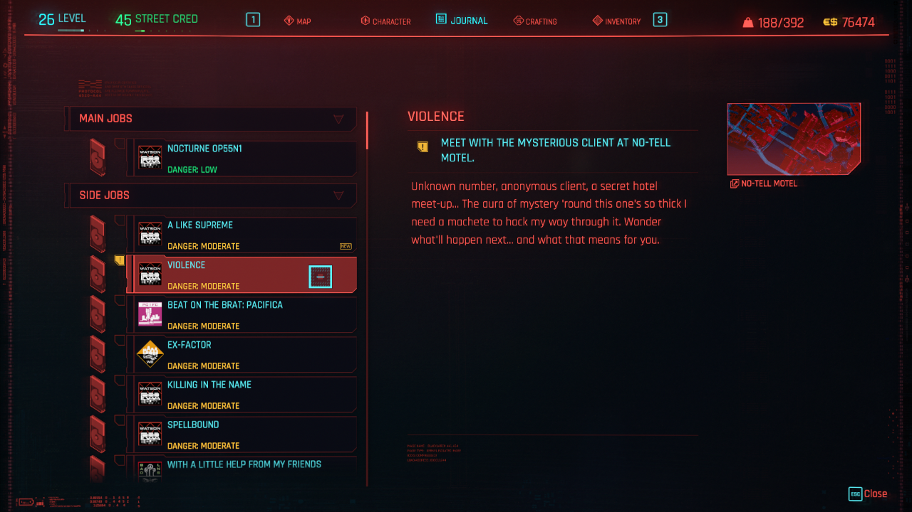
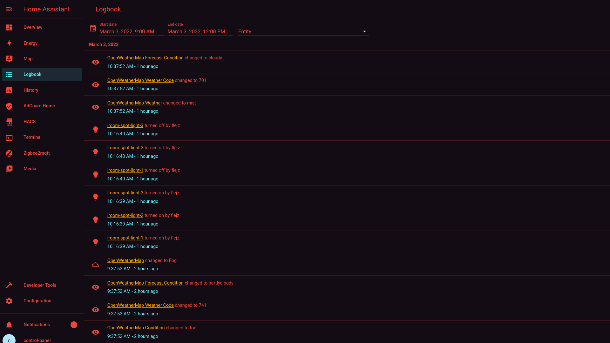
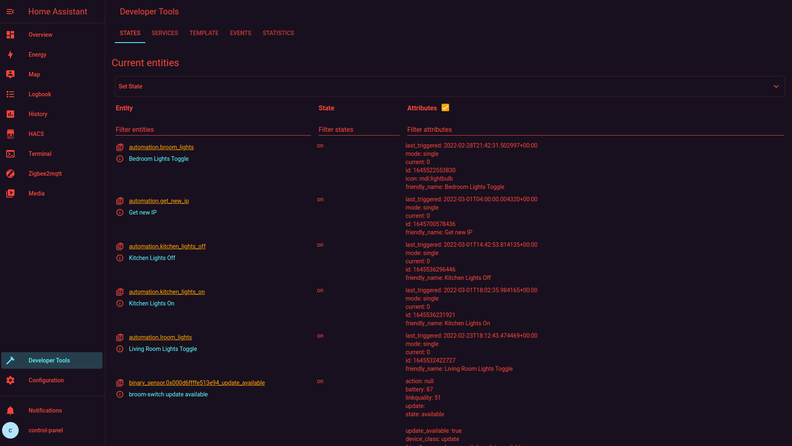
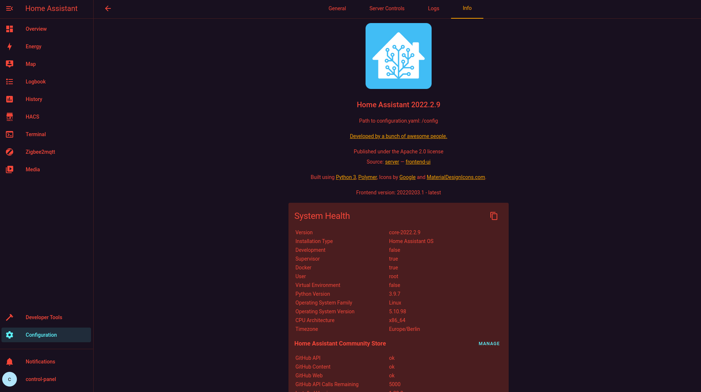
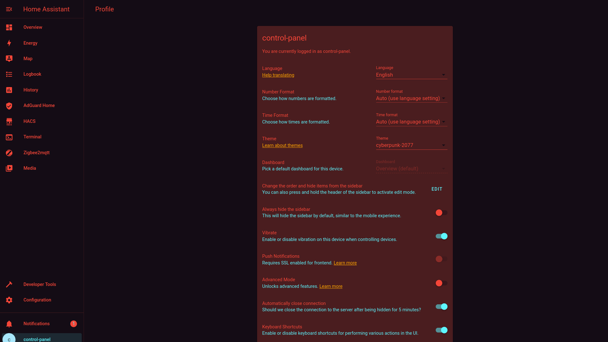

# Cyberpunk 2077 Home Assistant Theme

[](https://github.com/flejz/hass-cyberpunk-2077-theme/actions)
[](https://github.com/custom-components/hacs)

> The Cyberpunk 2077 Theme by @flejz

## Reference GUI



## Screenshots

### Overview


### Logbook



### History


### Developer Tools



### Configuration



### Profile



## Installation

Add the following code to your `configuration.yaml` file (reboot required).

```yaml
frontend:
  ... # your configuration.
  themes: !include_dir_merge_named themes
  ... # your configuration.
```

### HACS

1. Go to the Community Store.
2. Search for `Cyberpunk 2077`.
3. Navigate to `Cyberpunk 2077` theme.
4. Press `Install`.

### Manual

Clone this repository in your existing (or create it) `themes/` folder.

```bash
cd themes/
git clone https://github.com/flejz/hass-cyberpunk-2077-theme.git
```

Or using submodules:

```bash
cd themes/
git submodule add https://github.com/flejz/hass-cyberpunk-2077-theme.git
```

### Font

Optionally you can add the [Rajdhani](https://fonts.google.com/specimen/Rajdhani) font as a resource to have yet a closer experience:

`https://fonts.googleapis.com/css2?family=Rajdhani:wght@500&display=swap`
